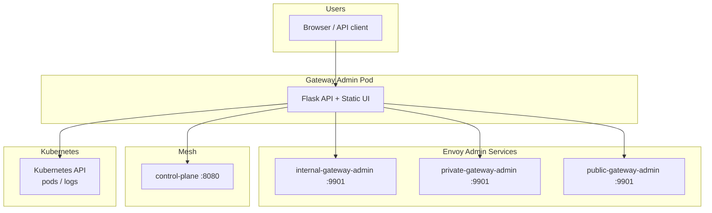

# Gateway Admin

[](https://www.python.org/)
[](https://flask.palletsprojects.com/)
[](https://kubernetes.io/)
[](https://www.envoyproxy.io/)
[](LICENSE)

**Production-oriented operations console for Qubership Envoy ingress gateways.**

Gateway Admin gives platform and SRE teams a single place to inspect gateway health, triage traffic by URL and HTTP status code, and surface impact logs during incidents — without logging into individual Envoy admin ports or parsing raw stats by hand.

---

## Table of contents

- [Why Gateway Admin](#why-gateway-admin)
- [Features](#features)
- [Quick start](#quick-start)
- [Architecture](#architecture)
- [Requirements](#requirements)
- [Installation](#installation)
- [Configuration](#configuration)
- [API reference](#api-reference)
- [Operations](#operations)
- [Development](#development)
- [Troubleshooting](#troubleshooting)
- [Security](#security)
- [Contributing](#contributing)
- [Related projects](#related-projects)
- [License](#license)

---

## Why Gateway Admin

Envoy exposes rich data on port `9901`, but that data is spread across multiple gateways, formats, and pods. During an outage you need answers fast:

- Which URL prefixes are returning **4xx/5xx**?
- Are upstreams healthy?
- Did xDS route updates fail?
- What log lines correlate with failed requests?

Gateway Admin aggregates this into a browser UI with auto-refresh, alert chips, and filterable impact logs — complementing Prometheus/Grafana (long-term trends) with **live triage** (right now).

---

## Features

| Capability | Details |
|------------|---------|
| **Multi-gateway dashboard** | Internal, private, and public Envoy gateways in one view |
| **HTTP code breakdown** | 2xx / 3xx / 4xx / 5xx per ingress and per route prefix |
| **Traffic triage** | Configured routes + observed request paths from access logs |
| **Alert detection** | No-route, upstream failures, timeouts, xDS update errors |
| **Impact logs** | Filtered Kubernetes pod logs (errors, 5xx, NR/UF flags) |
| **Envoy deep-dive** | Stats, clusters, listeners, config dump per gateway |
| **Health endpoints** | `/healthz` and `/readyz` for Kubernetes probes |
| **RBAC-aware logging** | Optional in-cluster ServiceAccount for log access |

---

## Quick start

For a minimal deployment on an existing Qubership mesh cluster:

```bash
# 1. Build image
docker build -t gateway-admin-ui:local .

# 2. Deploy
kubectl apply -f k8s/admin-services.yaml
kubectl apply -f k8s/rbac.yaml
kubectl apply -f k8s/deployment.yaml

# 3. Verify
kubectl -n qubership-mesh rollout status deployment/gateway-admin-ui
curl -sf http://<your-ingress-host>/healthz
```

Expose the UI through your mesh `RouteConfiguration` (prefix `/gateway-admin` → `gateway-admin-ui:80`). See [Installation](#installation) for the full walkthrough.

---

## Architecture



**Data sources**

| Source | Used for |
|--------|----------|
| Envoy `/stats/prometheus` | Request counts, HTTP classes, upstream health |
| Envoy `/config_dump` | Route prefix → cluster mapping |
| Envoy `/clusters`, `/listeners` | Upstream and listener inspection |
| Control plane `/ready` | Mesh control plane status |
| Pod logs (K8s API) | Impact log triage |

---

## Requirements

| Requirement | Notes |
|-------------|-------|
| Kubernetes **1.28+** | Tested on Minikube 1.31 |
| **Qubership ingress gateways** | Internal, private, public Envoy deployments |
| **Qubership control plane** | For route config and readiness |
| **kubectl** | Cluster access for deployment |
| **Container registry / local image** | Default image name: `gateway-admin-ui:local` |

**Optional**

- NGINX Ingress (or equivalent) for external HTTP access
- Mesh `RouteConfiguration` to expose UI via a gateway prefix
- ServiceAccount + RBAC (`k8s/rbac.yaml`) for impact log features

---

## Installation

### Step 1 — Build the container image

```bash
git clone https://github.com/mahendrasomavarapu/gateway-admin.git
cd gateway-admin

docker build -t gateway-admin-ui:local .
```

**Minikube / local cluster** — build inside the cluster Docker daemon:

```bash
eval $(minikube docker-env)
docker build -t gateway-admin-ui:local .
```

**Apple Silicon tip** — if pulling the base image fails, rebuild from an existing local layer:

```bash
docker build -f Dockerfile.update -t gateway-admin-ui:local .
```

### Step 2 — Deploy Kubernetes manifests

```bash
export NAMESPACE=qubership-mesh   # adjust for your environment

kubectl apply -f k8s/admin-services.yaml
kubectl apply -f k8s/rbac.yaml
kubectl apply -f k8s/deployment.yaml

kubectl -n "${NAMESPACE}" rollout status deployment/gateway-admin-ui
```

| Manifest | Purpose |
|----------|---------|
| `k8s/admin-services.yaml` | ClusterIP services targeting Envoy admin port `9901` on each gateway |
| `k8s/rbac.yaml` | ServiceAccount, Role, RoleBinding for pod log reads |
| `k8s/deployment.yaml` | Deployment, Service, Ingress, probes, resource limits |

### Step 3 — Register a mesh route

Add a route so traffic can reach the UI through an ingress gateway. Example for the **public** gateway:

```yaml
apiVersion: nc.core.mesh/v3
kind: RouteConfiguration
metadata:
  name: gateway-admin-public-routes
  namespace: qubership-mesh
spec:
  gateways: ["public-gateway-service"]
  virtualServices:
    - name: public-gateway-service
      hosts: ["*"]
      routeConfiguration:
        version: v1
        routes:
          - destination:
              cluster: gateway-admin-ui
              endpoint: gateway-admin-ui:80
            rules:
              - match:
                  prefix: /gateway-admin
                allowed: true
                prefixRewrite: /
```

Apply via your control plane API (example using `kubectl exec`):

```bash
kubectl -n qubership-mesh exec -i deployment/gateway-admin-ui -- \
  python3 -c "
import sys, urllib.request
body = sys.stdin.buffer.read()
req = urllib.request.Request(
    'http://control-plane:8080/api/v3/apply-config',
    data=body,
    headers={'Content-Type': 'application/yaml'},
    method='POST',
)
with urllib.request.urlopen(req, timeout=60) as resp:
    print(resp.status, resp.read().decode())
" < your-routes.yaml
```

### Step 4 — Verify

```bash
# In-cluster
kubectl -n qubership-mesh run curl-test --rm -i --restart=Never \
  --image=curlimages/curl:8.11.1 -- \
  curl -sf http://gateway-admin-ui/healthz

# Readiness (gateways + control plane)
kubectl -n qubership-mesh run curl-ready --rm -i --restart=Never \
  --image=curlimages/curl:8.11.1 -- \
  curl -sf http://gateway-admin-ui/readyz
```

---

## Configuration

### Environment variables

| Variable | Default | Description |
|----------|---------|-------------|
| `INTERNAL_ADMIN_HOST` | `internal-gateway-admin` | Internal gateway Envoy admin host |
| `INTERNAL_ADMIN_PORT` | `9901` | Internal gateway Envoy admin port |
| `PRIVATE_ADMIN_HOST` | `private-gateway-admin` | Private gateway Envoy admin host |
| `PRIVATE_ADMIN_PORT` | `9901` | Private gateway Envoy admin port |
| `PUBLIC_ADMIN_HOST` | `public-gateway-admin` | Public gateway Envoy admin host |
| `PUBLIC_ADMIN_PORT` | `9901` | Public gateway Envoy admin port |
| `CP_API_HOST` | `control-plane` | Control plane hostname |
| `CP_API_PORT` | `8080` | Control plane HTTP port |
| `POD_NAMESPACE` | `qubership-mesh` | Namespace for Kubernetes log queries |
| `CACHE_TTL_SECONDS` | `5` | API response cache TTL (seconds) |
| `PORT` | `8080` | HTTP port when running outside Kubernetes |

### Pod label overrides (logs)

| Variable | Default |
|----------|---------|
| `INTERNAL_POD_LABEL` | `name=internal-gateway` |
| `PRIVATE_POD_LABEL` | `name=private-frontend-gateway` |
| `PUBLIC_POD_LABEL` | `name=public-frontend-gateway` |
| `CP_POD_LABEL` | `name=control-plane` |

> **Important:** Do **not** use `CONTROL_PLANE_PORT` as an environment variable name. Kubernetes injects service-linked env vars that conflict with it. Always use `CP_API_PORT`.

### Resource recommendations

| Environment | CPU request | CPU limit | Memory limit |
|-------------|-------------|-----------|--------------|
| Development | 100m | 500m | 256Mi |
| Production | 250m | 1 | 512Mi |

Adjust in `k8s/deployment.yaml` based on gateway count and log query volume.

---

## API reference

### Health

| Method | Path | Description |
|--------|------|-------------|
| `GET` | `/healthz` | Liveness — process is running |
| `GET` | `/readyz` | Readiness — all gateway admins + control plane reachable |

### UI & aggregation

| Method | Path | Description |
|--------|------|-------------|
| `GET` | `/` | Web application |
| `GET` | `/api/gateways` | Gateway list with readiness |
| `GET` | `/api/overview` | Dashboard metrics, alerts, impact logs |
| `GET` | `/api/logs/impact` | Cross-component impact logs |

### Per-gateway (`<id>` = `internal` \| `private` \| `public`)

| Method | Path | Description |
|--------|------|-------------|
| `GET` | `/api/gateways/<id>/traffic` | Per-URL traffic, HTTP codes, alerts |
| `GET` | `/api/gateways/<id>/logs` | Impact logs (`?tail=300`, `?impact=true`) |
| `GET` | `/api/gateways/<id>/stats` | Envoy stats (JSON) |
| `GET` | `/api/gateways/<id>/clusters` | Envoy cluster status |
| `GET` | `/api/gateways/<id>/listeners` | Envoy listener status |
| `GET` | `/api/gateways/<id>/config_dump` | Full Envoy configuration |
| `GET` | `/api/gateways/<id>/prometheus` | Raw Prometheus exposition |

### Control plane

| Method | Path | Description |
|--------|------|-------------|
| `GET` | `/api/control-plane/ready` | Control plane readiness |
| `GET` | `/api/control-plane/health` | Control plane health |
| `GET` | `/api/control-plane/migration` | Migration status |

---

## Operations

### Upgrade

```bash
docker build -f Dockerfile.update -t gateway-admin-ui:local .
kubectl -n qubership-mesh rollout restart deployment/gateway-admin-ui
kubectl -n qubership-mesh rollout status deployment/gateway-admin-ui
```

### Health monitoring

```bash
curl -s https://<host>/healthz | jq .
curl -s https://<host>/readyz | jq .
```

### Application logs

```bash
kubectl -n qubership-mesh logs deployment/gateway-admin-ui -f --tail=200
```

### Incident triage workflow

1. Open the **Dashboard** — check alert counts and 4xx/5xx totals.
2. Select the affected gateway → **Traffic** tab — sort by errors, filter by URL prefix.
3. Open **Impact Logs** — correlate timestamps and paths.
4. Use **Clusters** / **Config Dump** for upstream or routing misconfiguration.
5. Cross-check with Prometheus/Grafana for historical context.

---

## Development

### Local run (with port-forward)

```bash
cd app
python3 -m venv .venv && source .venv/bin/activate
pip install -r requirements.txt

# Forward Envoy admin and control plane
kubectl -n qubership-mesh port-forward svc/public-gateway-admin 9901:9901 &
kubectl -n qubership-mesh port-forward svc/control-plane 8080:8080 &

export PUBLIC_ADMIN_HOST=127.0.0.1
export PUBLIC_ADMIN_PORT=9901
export CP_API_HOST=127.0.0.1
export CP_API_PORT=8080

python server.py
# http://localhost:8080
```

Impact log features require in-cluster deployment (Kubernetes ServiceAccount).

### Project structure

```
gateway-admin/
├── app/
│   ├── server.py              # Flask application and routes
│   ├── metrics_parser.py      # Envoy Prometheus + route analytics
│   ├── k8s_logs.py            # Kubernetes log collection and filtering
│   ├── requirements.txt
│   └── static/                # Frontend (HTML, CSS, JS)
├── k8s/
│   ├── admin-services.yaml    # Envoy admin ClusterIP services
│   ├── rbac.yaml              # Log access RBAC
│   └── deployment.yaml        # Workload, Service, Ingress
├── Dockerfile
├── Dockerfile.update          # Incremental image rebuild
├── LICENSE
└── README.md
```

---

## Troubleshooting

| Symptom | Likely cause | Resolution |
|---------|--------------|------------|
| All gateways show **Not Ready** | Admin services missing or wrong selectors | `kubectl get svc -n <ns> \| grep gateway-admin` |
| **Traffic** table empty | xDS not synced or no routes in `config_dump` | Re-apply routes; wait 10–30s |
| High **4xx** / **no_route** | Route prefix mismatch | Verify `RouteConfiguration` prefixes |
| `readyz` returns 503 | Control plane or gateway admin unreachable | Check pod status and admin services |
| `logs_available: false` | RBAC not applied or not in-cluster | Apply `k8s/rbac.yaml`; confirm ServiceAccount on Deployment |
| Impact logs empty | No recent errors in tail window | Increase `?tail=`; check gateway pod logs directly |
| Stale metrics | Cache TTL | Lower `CACHE_TTL_SECONDS` or wait 5s between refreshes |

**Debug Envoy admin connectivity:**

```bash
kubectl -n qubership-mesh exec deployment/gateway-admin-ui -- \
  python3 -c "
import urllib.request
for gw in ['internal','private','public']:
    host = f'{gw.replace(\"public\",\"public\")}-gateway-admin'
    if gw == 'internal': host = 'internal-gateway-admin'
    elif gw == 'private': host = 'private-gateway-admin'
    else: host = 'public-gateway-admin'
    r = urllib.request.urlopen(f'http://{host}:9901/ready', timeout=5)
    print(host, r.status, r.read()[:20])
"
```

---

## Security

Gateway Admin is a **powerful operations tool**. Treat it accordingly:

| Risk | Mitigation |
|------|------------|
| Exposes Envoy admin data | Restrict Ingress; use network policies; require SSO/reverse-proxy auth in production |
| Reads pod logs | Scope RBAC to required namespaces and labels only |
| No built-in authentication | Place behind OAuth2 proxy, VPN, or internal-only ingress |
| Default dev Ingress host | Change `gateway-admin.mahendra.com` in `k8s/deployment.yaml` |

Do not expose Gateway Admin to the public internet without authentication and TLS.

---

## Contributing

Contributions are welcome.

1. Fork the repository
2. Create a feature branch (`git checkout -b feature/my-change`)
3. Commit with a clear message
4. Open a Pull Request

Please keep changes focused and include updates to this README when adding features or configuration options.

---

## Related projects

| Project | Description |
|---------|-------------|
| [Qubership Core Control Plane](https://github.com/Netcracker/qubership-core-control-plane) | Mesh control plane |
| [Qubership Core Ingress Gateway](https://github.com/Netcracker/qubership-core-ingress-gateway) | Envoy ingress gateway Helm chart |
| [Envoy Proxy](https://www.envoyproxy.io/) | Underlying data plane |

---

## License

This project is licensed under the [MIT License](LICENSE).

Upstream Qubership mesh components are subject to their own licenses. See Netcracker Qubership repositories for details.

---

<p align="center">
  <sub>Built for operators who need fast answers when gateways misbehave.</sub>
</p>